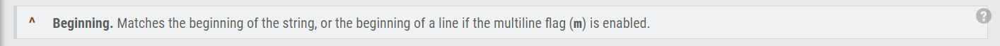
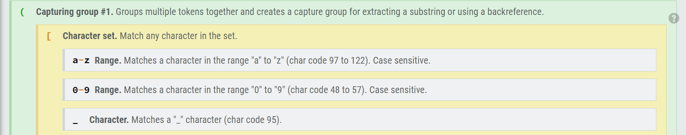
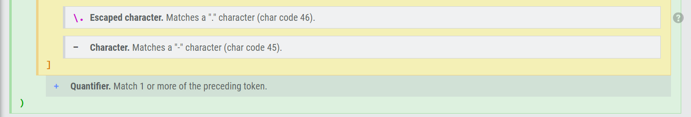
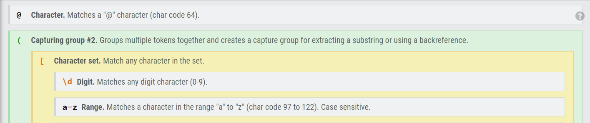
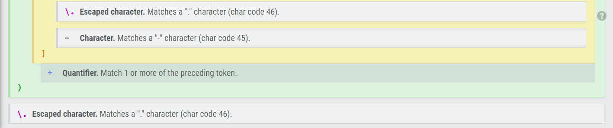
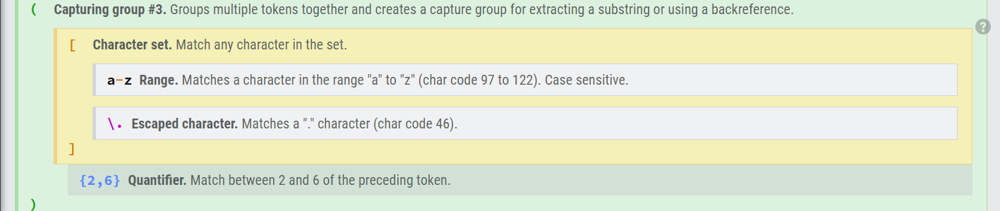
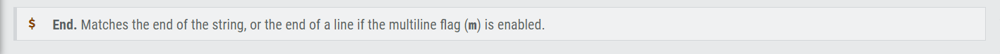

# Regex Tutorial

AS A web development student
I WANT a tutorial explaining a specific regex
SO THAT I can understand the search pattern the regex defines

## Summary

A Regex, or regular expression, is a sequence of characters that define a search's parameters.
We will look at an example denoting a proper email address.

Example: `/^([a-z0-9_\.-]+)@([\da-z\.-]+)\.([a-z\.]{2,6})$/`

## Table of Contents

- [Anchors](#anchors)
- [Quantifiers](#quantifiers)
- [OR Operator](#or-operator)
- [Character Classes](#character-classes)
- [Flags](#flags)
- [Grouping and Capturing](#grouping-and-capturing)
- [Bracket Expressions](#bracket-expressions)
- [Greedy and Lazy Match](#greedy-and-lazy-match)
- [Boundaries](#boundaries)
- [Back-references](#back-references)
- [Look-ahead and Look-behind](#look-ahead-and-look-behind)

## Regex Components

### Anchors

* `^` matches the start of the string.
* `$` matches the end of the string.

### Quantifiers

* `+` Matches 1 or more of the preceding token.
* `*` Matches 0 or more of the preceding token.
* `?` Matches 0 or 1 of the preceding token, effectively making it optional.

### OR Operator

* `|` Acts like a boolean. Matches the expression before or after the |. This OR that.

### Character Classes

* `[ABC]` Characters inside brakets will match any character in the set.
* `[^ABC]` Adding a caret will match any character that is not in the set.
* `[A-Z]` Add a dash between two characters will select a Range.
* `\w` Matches any word character (alphanumeric & underscore). Only matches low-ascii characters 
(no accented or non-roman characters).
* `\W` Matches any character that is not a word character (alphanumeric & underscore).
* `\d` Matches any digit character (0-9)
* `\p` Matches a character in the specified unicode category.

### Flags

* `i` Ignores case
* `g` Global search retain the index of the last match, allowing subsequent searches to start from the end of the previous match. Without the global flag, subsequent searches will return the same match.
* `m` Multiline flag When the multiline flag is enabled, beginning and end anchors (^ and $) will match the start and end of a line, instead of the start and end of the whole string.
* `u` Unicode
* `y` The expression will only match from its lastIndex position and ignores the global (g) flag if set. Because each search in RegExr is discrete, this flag has no further impact on the displayed results.
* `s` Dot (.) will match any character, including newline.

### Grouping and Capturing

* `(ABC)` Capturing groups multiple tokens together and creates a capture group for extracting a substring or using a backreference.
* `(?<name>ABC)` named capturing group captures groups of a specific name.
* `\1` is a numeric reference
* `(?:ABC)` Groups multiple tokens together without creating a capture group.

### Bracket Expressions

A bracket expression enclosed in square brackets is a regular expression that matches a single character, or collating element. If the initial character is a circumflex ^, then this bracket expression is complemented.

### Greedy and Lazy Match

* `?` Makes the preceding quantifier lazy, causing it to match as few characters as possible. 
By default, quantifiers are greedy, and will match as many characters as possible.

### Boundaries

* `i` Ignores case
* `g` Global search retain the index of the last match, allowing subsequent searches to start from the end of the previous match. 
Without the global flag, subsequent searches will return the same match.
* `m` Multiline flag When the multiline flag is enabled, beginning and end anchors (^ and $) will match the start and end of a line, 
instead of the start and end of the whole string.
* `u` Unicode
* `y` The expression will only match from its lastIndex position and ignores the global (g) flag if set. Because each search in RegExr is discrete, this flag has no further impact on the displayed results.
* `s` Dot (.) will match any character, including newline.

### Back-references

Backreferences match the same text as previously matched by a capturing group. Suppose you want to match a pair of opening and closing HTML tags, and the text in between. By putting the opening tag into a backreference, we can reuse the name of the tag for the closing tag.

For Example: `<([A-Z][0-9]*)\b[^>]*>.*?</\1>` This regex contains only one pair of parentheses, which capture the string matched by `[A-Z][0-9]*`. This is the opening HTML tag. The backreference `\1` references the first capturing group. `\1` matches the exact same text that was matched by the first capturing group. The `/` before it is a literal character. It is simply the forward slash in the closing HTML tag that we are trying to match.

### Look-ahead and Look-behind

* `(?=ABC)` is a postive lookahead and it matches a group after the main expression without including it in the result.
* `(?!ABC)` is a negitive lookahead and it specifies a group that can not match after the main expression (if it matches, the result is discarded)
* `(?<=ABC>)` is a postive lookbehind and matches a group before the main expression without including it in the result.
* `(?<!ABC)` is a negitive lookbehind and Specifies a group that can not match before the main expression (if it matches, the result is discarded).

## Author

https://github.com/TheTrueZK
